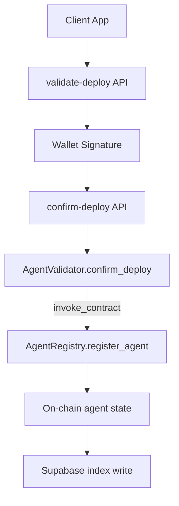
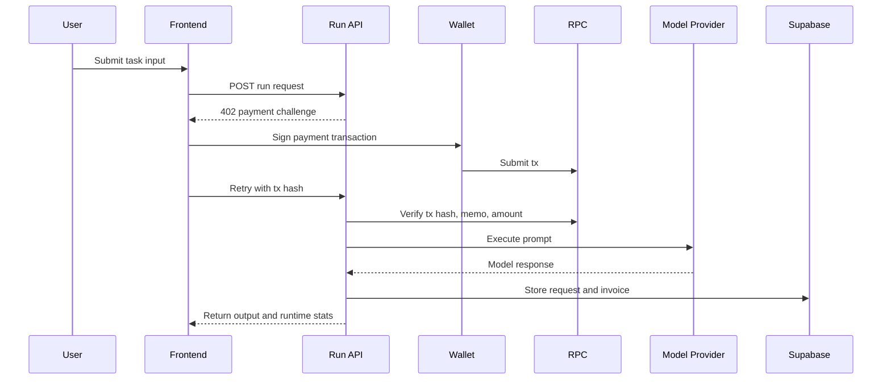

# Valdyum Architecture Blueprint

## Executive Summary

Valdyum is a protocol-driven AI commerce stack built on Solana. It turns AI execution into verifiable economic activity by binding each paid interaction to a wallet signature and on-chain payment evidence.

The platform solves three hard problems at once:
- Agent monetization without centralized billing trust assumptions
- Programmable deployment policy using Anchor contracts
- Realtime operational visibility for builders and consumers

## Problem Statement

Modern AI agent platforms usually rely on API keys, opaque usage logs, and delayed settlement. That model creates friction for open marketplaces because payment, execution, and attribution are disconnected.

Valdyum addresses this with a payment-first execution model:
- A request that requires payment returns a structured challenge
- The caller signs and submits a Solana transaction
- The backend verifies payment proof before execution
- Runtime output and billing metadata are persisted and streamed

## Why Solana Was The Best Fit

Solana provides practical advantages for autonomous-agent commerce:
- Very low fee profile for frequent micro-payments
- Fast and predictable settlement suitable for interactive UX
- Native memo support, ideal for request/fork/deploy correlation IDs
- Mature wallet ecosystem for explicit user-controlled signatures
- Public verifiability through RPC and Explorer

Anchor extends this with deterministic contract policy:
- Deployment can be validated before registration
- Registry writes can be gated through validator logic
- Inter-contract calls let governance evolve without breaking API contracts

## System Components

### 1) Experience Layer
- Next.js App Router frontend
- Wallet connect and signing UX (Phantom-first)
- Marketplace, Builder, Trading, Workflow, Dashboard surfaces

### 2) API and Orchestration Layer
- Route handlers for deploy, run, payment verify, analytics
- 402 challenge/response implementation for paid runs
- Solana RPC integration for transaction verification
- AI provider routing (OpenAI and Anthropic)

### 3) On-Chain Policy Layer
- AgentValidator contract for deployment gating
- AgentRegistry contract for canonical on-chain agent state
- Inter-contract registration path via validator confirmation

### 4) Data and Event Layer
- Supabase for agents, requests, invoices, analytics
- Ably for realtime event fanout
- QStash consumers for asynchronous event processing

## End-To-End Workflow

## Phase A: Identity and Session Bootstrap
1. User connects wallet in UI.
2. Public key is stored client-side for session context.
3. Backend receives wallet identity headers for signed operations.

## Phase B: Agent Deployment Pipeline
1. User configures agent metadata in builder.
2. API creates unsigned validation transaction payload.
3. Wallet signs deploy validation transaction.
4. API submits to RPC and prepares confirmation transaction.
5. Wallet signs confirmation transaction.
6. AgentValidator confirms and invokes AgentRegistry registration.
7. Backend persists resulting agent record and metadata indexes.

## Phase C: Marketplace Discovery and Forking
1. Public agents are listed with pricing and owner metadata.
2. User starts fork flow and customizes prompt/system settings.
3. Fork payment is signed and submitted on Solana.
4. Explorer tx hash is shown in-app for transparent proof.
5. Forked agent is available for run flow.

## Phase D: Paid Agent Execution (0x402 style)
1. Client posts run request to agent endpoint.
2. If unpaid, server returns payment challenge details.
3. Wallet signs transaction and submits payment.
4. Client retries with tx hash + wallet header.
5. Server verifies transaction details and memo integrity.
6. On success, selected model runs and response is returned.
7. Request, invoice, and runtime stats are persisted.

## Phase E: Workflow and Trading Surfaces
1. Workflow queue triggers paid task steps in sequence.
2. Wallet approvals gate costly operations.
3. Invoice cards provide tx hash, amount, wallet, timestamp, and status.
4. Trading UI provides strategy context and wallet-aware controls.

## Phase F: Analytics and Operations
1. Events stream to dashboard surfaces.
2. Aggregations display request velocity, billing, and latency.
3. Operators can reconcile app metrics against Explorer truth.

## Inter-Contract Call Topology

## Runtime Data Flow

## Trust and Security Model

- Payment verification is externalized to Solana/RPC truth.
- Sensitive credentials remain server-side and are never client-exposed.
- Local env secret files are excluded from git history and CI pushes.
- Wallet signatures provide explicit user consent for value movement.

## Evidence Anchors

Known verified explorer transaction:
- https://stellar.expert/explorer/testnet/tx/0367f4f328678305d283ed8fc7b71866df5f0523e7efa3ef00bb3abc2b77e541

Observed evidence elements:
- Status successful
- Memo integrity preserved for flow correlation
- Fee charged at micro-payment scale
- Signature linked to source account

## Operational Readiness

CI/CD confirms deploy readiness via:
- ESLint + TypeScript gate
- Production build gate
- Docker build gate

This layered architecture ensures the product is usable by humans while still being composable for autonomous clients and programmable for protocol-level evolution.
